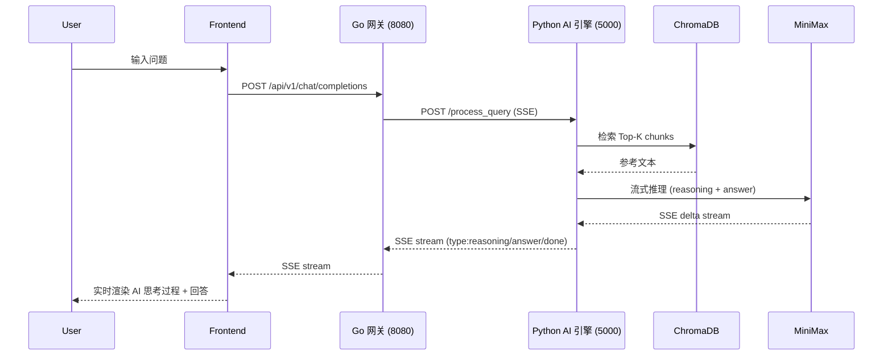

# Lumina Insight

> 企业级 RAG 知识库问答系统 — V1.0 MVP

基于 MiniMax-M2.7 大模型、ChromaDB 向量数据库、Go + Python 双服务架构的智能问答系统。

---

## 系统架构



---

## 快速启动

### 前置条件

- Go 1.21+
- Python 3.12+（建议使用 `uv` 管理虚拟环境）
- MiniMax API Key

### 1. 配置环境变量

```bash
# .env 文件（从 .env.example 复制）
MINIMAX_API_KEY=your_api_key_here
MINIMAX_GROUP_ID=your_group_id_here
PYTHON_HOST=127.0.0.1
PYTHON_PORT=5000
```

### 2. 启动 Python AI 引擎

```bash
cd python
.venv\Scripts\uvicorn.exe src.api.server:app --host 0.0.0.0 --port 5000
```

### 3. 启动 Go 后端网关

```bash
cd backend
go run cmd/server/main.go
```

### 4. 启动前端

```bash
cd frontend
npm install
npm run dev
```

---

## 核心功能

| 功能 | 状态 |
|------|------|
| 文档上传 / 入库 | ✅ |
| 向量语义检索 | ✅ |
| SSE 流式回答 | ✅ |
| AI 思考过程展示 | ✅ |
| 幻觉防御（老实说"未找到"） | ✅ |
| 参考来源标注 | ✅ |

---

## 文档导航

| 文档 | 说明 |
|------|------|
| [PRD（产品需求）](document/01_Lumina_Insight_PRD.md) | 产品功能定义 |
| [工程规范](document/02_Engineering_Standards_and_Coding_Protocols.md) | 代码风格、Git 规范 |
| [系统架构](document/03_System_Architecture_and_Technical_Roadmap.md) | 技术架构详细说明 |
| [API 合约与部署](document/04_API_Contracts_and_Deployment_Guide.md) | 接口定义、部署指南 |
| [V1.0 复盘踩坑](docs/v1.0_POST_MORTEM.md) | V1.0 核心问题与解决方案 |
| [V2.0 路线图](docs/v2.0_ROADMAP.md) | 未来演进方向与改进计划 |

---

## 目录结构

```
D:\code\ai\rag\
├── backend/                    # Go 网关服务
│   ├── cmd/server/             # 入口
│   ├── internal/
│   │   ├── handler/           # HTTP handlers
│   │   ├── service/            # 业务逻辑
│   │   └── storage/            # SQLite 存储
│   └── uploads/                # 文件暂存（gitignore）
├── frontend/                    # React 前端
│   └── src/
│       ├── components/         # UI 组件
│       └── App.tsx
├── python/                     # Python AI 引擎
│   └── src/
│       ├── api/                # FastAPI 服务
│       ├── core/
│       │   ├── chunker/        # 文档分块
│       │   ├── embedder/       # 向量化
│       │   ├── llm/           # MiniMax 客户端
│       │   └── retriever/      # 检索器
│       └── vector_db/          # ChromaDB 持久化
├── document/                    # 项目文档（PRD/架构/规范）
│   ├── 01_Lumina_Insight_PRD.md
│   ├── 02_Engineering_Standards_and_Coding_Protocols.md
│   ├── 03_System_Architecture_and_Technical_Roadmap.md
│   ├── 04_API_Contracts_and_Deployment_Guide.md
│   └── v1.0_mvp_assets/       # V1.0 测试文档
│       ├── real/               # 真实 PDF（比亚迪年报、大疆手册）
│       └── synthetic/          # 合成测试数据（金融/技术/法律）
├── docs/                        # 版本化文档
│   ├── v1.0_POST_MORTEM.md    # V1.0 踩坑复盘
│   └── v2.0_ROADMAP.md        # V2.0 演进规划
└── README.md                    # 本文件
```

---

## 技术栈

| 层级 | 技术 |
|------|------|
| 前端 | React + TypeScript + Tailwind CSS |
| 网关 | Go + Gin |
| AI 引擎 | Python + FastAPI + MiniMax-M2.7 |
| 向量数据库 | ChromaDB |
| Embedder | paraphrase-multilingual-MiniLM-L12-v2 |
| PDF 解析 | pdfplumber + PyMuPDF（规划） |

---

## API 端点

| 方法 | 路径 | 说明 |
|------|------|------|
| POST | `/api/v1/chat/completions` | 流式问答（走 Go） |
| POST | `/api/v1/docs/upload` | 上传文档（走 Go） |
| POST | `/api/v1/system/reset` | 清空 ChromaDB |
| POST | `/process_query` | Python 直连流式问答 |
| POST | `/ingest` | Python 直连接口入库 |
| POST | `/reset_db` | Python 直连重置 DB |
| POST | `/upload` | Python 直连上传 |
